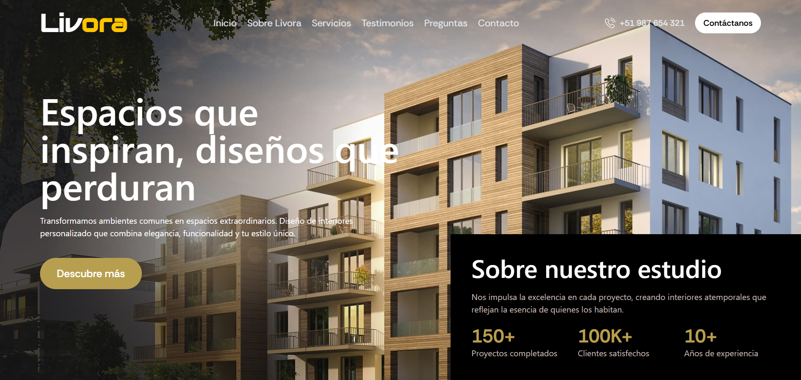

# 🏠 LIVORA · Diseño de Interiores que Transforma ✨

[](https://livora-sigma.vercel.app/)

Bienvenido a **Livora**, tu aliado en diseño de interiores donde cada espacio cuenta una historia única. Creemos que **cada ambiente es una oportunidad para inspirar, cada detalle refleja personalidad y cada proyecto transforma vidas**.
Con un diseño elegante, profesional y completamente responsive, **Livora** te conecta con servicios de diseño de interiores excepcionales que elevarán tu espacio al siguiente nivel. 🎨🏡

---

## 🌟 Características Principales

- 🎨 **Portafolio de proyectos destacados** con diseños residenciales y comerciales inspiradores.
- 🛋️ **Servicios integrales de diseño**, desde conceptualización hasta ejecución completa.
- 💎 **Diseño minimalista y elegante**, optimizado con Tailwind CSS.
- 📱 **Totalmente responsive**, adaptado a móviles, tablets y escritorio.
- 🔄 **Navegación activa inteligente**, que resalta automáticamente la sección actual.
- 📊 **Contador animado de logros** con React CountUp.
- 🚀 **Rendimiento optimizado con Next.js 16**, garantizando velocidad y experiencia fluida.

---

## ❓ ¿Por qué Livora?

El nombre **Livora** representa nuestra esencia:

- **Liv** = Live (Vivir) - Espacios diseñados para vivir plenamente.
- **ora** = Oro - La excelencia y calidad premium que aportamos a cada proyecto.

Nuestro objetivo es **transformar tu visión en espacios extraordinarios** con una plataforma que combine profesionalismo, creatividad y atención al detalle excepcional.

---

## 🛠️ Tecnologías Utilizadas 👨‍💻

| HTML | CSS | JavaScript | React | TypeScript | Tailwind CSS | Next.js | Node.js |
|------|-----|------------|--------|-------------|---------------|--------|---------|
|  |  |  |  |  |  |  |  |

**Librerías adicionales:**
- 🎠 **Swiper** - Carruseles modernos e interactivos
- 🔢 **React CountUp** - Animación de contadores de logros
- 🎯 **Bootstrap Icons** - Iconografía profesional
- 🖼️ **Next/Image** - Optimización avanzada de imágenes

---

## 🚀 Instalación y Uso Local

Sigue estos pasos para clonar y ejecutar el proyecto en tu máquina local:

1. **Clona el repositorio:**
```bash
git clone https://github.com/carlossilvadev10/liv-ora.git
```

2. **Entra en el directorio del proyecto:**
```bash
cd livora
```

3. **Instala las dependencias necesarias:**
```bash
npm install
```

4. **Ejecuta la aplicación en entorno de desarrollo:**
```bash
npm run dev
```

5. **Abre tu navegador y visita:**
```bash
http://localhost:3000
```
---

## 📩 Contacto

Si tienes alguna pregunta o sugerencia, puedes encontrarme en:

- 🌐 [Mi GitHub](https://github.com/carlossilvadev10)
- 📧 Email: [carlos.esilva1007@gmail.com](mailto:carlos.esilva1007@gmail.com)
- 💼 [Mi LinkedIn](https://www.linkedin.com/in/carlos-eduardo-silva-bustamante-b6084528b)

---

💡 **Livora** es más que una agencia de diseño: Es una **invitación a transformar espacios en experiencias que inspiran** y a vivir en ambientes que reflejan tu **esencia y estilo único**.

🏠 **¡Tu espacio perfecto comienza aquí!** ✨